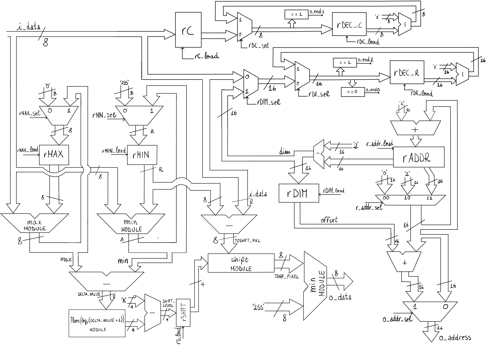

# Prova Finale Reti Logiche 2020-2021
This is the project for the *Prova Finale* of the course _Reti Logiche_ held at Politecnico di Milano.
It consists in designing and developing a module using the VHDL language given a natural language specification of its operation. 

In particular, the aim of the course is to apply complex circuit design techniques using the VHDL language and synthesis tools used for the development of FPGAs using Xilinx VIVADO software.

## Assignment 
The hardware component to be designed should implement a simplified version of the [Histogram equalization](https://en.wikipedia.org/wiki/Histogram_equalization). Full **description of the assignment** is available [here](/PFRL_Specifica_20_21_V3.pdf) (in italian).

## Solution
The implementation consists of a finite state machine which determins the phases of the following datapath containing all the needed components for the computation of the histogram equalization algorithm.

A detailed **explanation** of the whole implementation is available [here](/report.pdf) (in italian).

## Datapath 

## FSM

## Final Grade 
This project has obtained the following evaluation: *30/30*.
